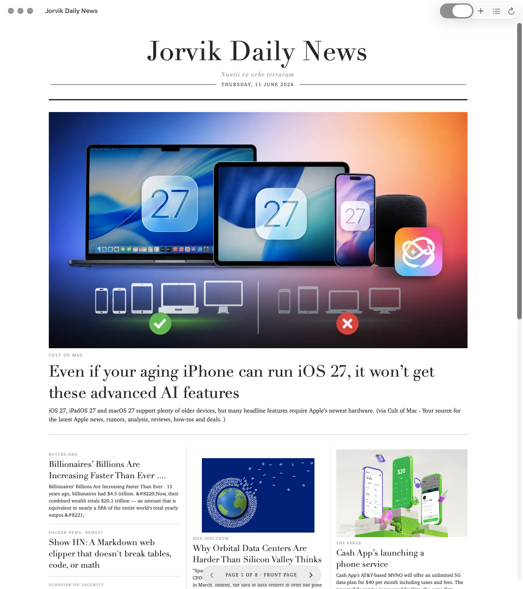
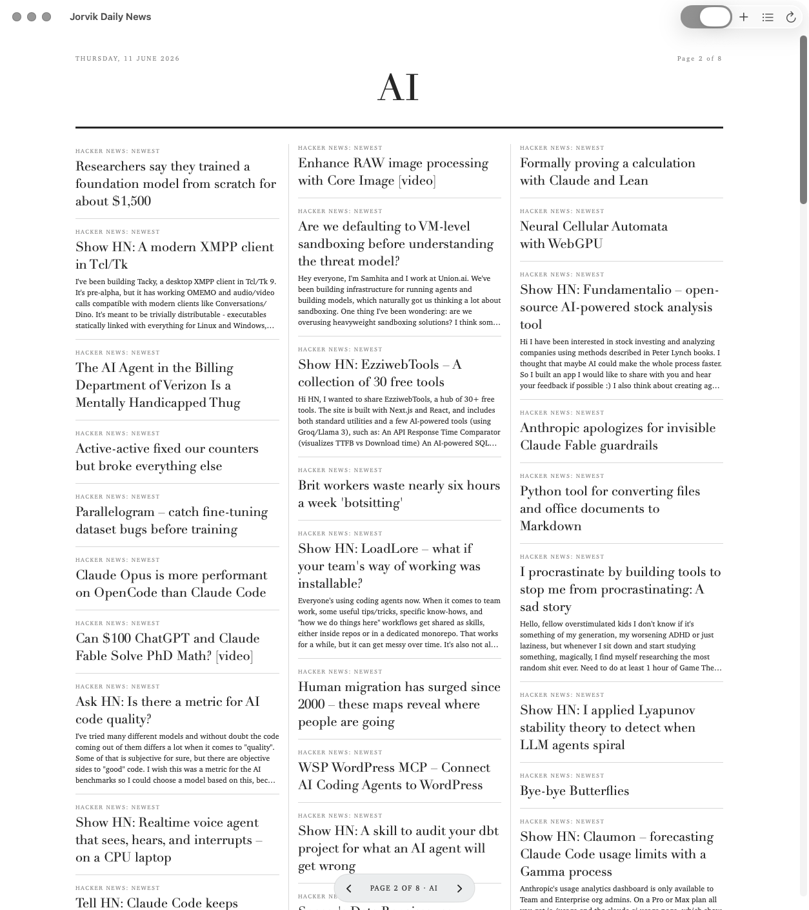
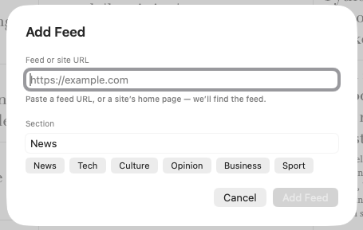
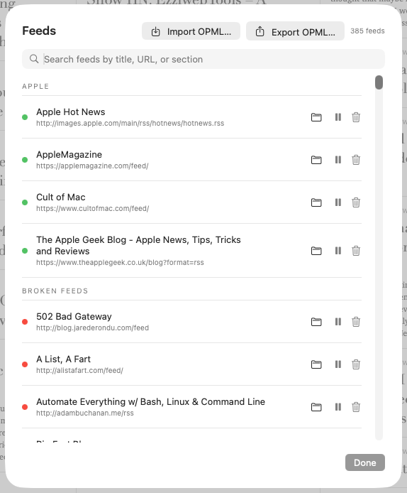

# Jorvik Daily News

A macOS RSS reader shaped like a daily newspaper. The paper only shows items whose published date falls inside today's local calendar — older items never appear, no matter how unread they are. Launch refreshes automatically and the paper re-fetches on each clock hour while it's open; `⌘R` republishes on demand. Anti-doomscroll: no unread counts, no infinite stream, finite by design.



## Requirements

- macOS 14 (Sonoma) or later
- Any RSS, Atom, or JSON feed URLs you want to read

## Installation

Two formats on every release — both signed and notarised:

- **[Installer (`.pkg`)](https://github.com/PerpetualBeta/JorvikDailyNews/releases/latest/download/JorvikDailyNews.pkg)** — recommended for first-time installs. Double-click to run; macOS Installer places the app in `/Applications` without quarantine or App Translocation.
- **[Download (`.zip`)](https://github.com/PerpetualBeta/JorvikDailyNews/releases/latest)** — unzip and drag `JorvikDailyNews.app` to your Applications folder.

## Why

RSS readers are streams. Streams never end. You open the reader, scroll past the same headlines you already ignored, and close it again no better informed.

A newspaper is the other shape. It publishes for a specific day, it's finite, you finish it. This app takes your feeds and publishes only what came out *today* — no yesterday's leftovers, no unread counts shaming you into scrolling. You read the paper, put it down, and get on with your day.

## How It Works

The paper is rebuilt from whatever your feeds have published today. While the app is open it re-fetches on each clock-hour boundary (09:00, 10:00, 11:00…) and again on wake-from-sleep, so the paper stays current without ever showing stale content. Once the clock rolls past midnight, today's paper starts fresh; the app keeps only the last few days of editions on disk and clears older ones automatically, because the whole point is today's news.

The front page is a full-width lead story above a 3-column masonry of the rest of the day's news. The lead *must* carry an image that actually loads — a text-only hero looks like a mistake at full-width span — so the builder picks the newest image-bearing story for the lead, validates and warms its image before publishing, and falls back to no lead at all (just the three columns) on a quiet day when nothing qualifies. Section pages follow if you've tagged feeds by topic (News / Tech / Culture / …). Click any headline to read the article in a clean reader pane — extracted via Mozilla's Readability, rendered in serif type, no ads, no trackers.

## Screenshots

| | |
|---|---|
|  |  |
| Section pages collect a topic's stories into their own masonry. | Add a feed by URL — or paste a site's home page and it finds the feed. |
|  | |
| Manage Feeds: search, section, pause, or remove; a colour dot shows each feed's fetch health. | |

## Using It

| Action | Shortcut |
|---|---|
| Add Feed | `⌘N` |
| Refresh | `⌘R` |
| Manage Feeds | `⇧⌘F` |
| Import OPML | `⇧⌘O` |
| Export OPML | `⇧⌘E` |
| Front Page | `⌘1` |
| Previous Page | `⌘←` |
| Next Page | `⌘→` |
| Scroll to top / bottom | `Home` / `End` |
| Scroll by viewport | `PgUp` / `PgDn` |
| Back to paper (from reader) | `Esc` |

### Adding feeds

`⌘N` → paste a feed URL *or a site's home page* → optionally tag with a section → Add. The app auto-discovers feeds: paste `https://arstechnica.com` and it finds the feed via `<link rel="alternate">` in the page head. If the page declares no feed, common paths (`/feed`, `/rss`, `/atom.xml`, `/feed.xml`, …) are probed as a fallback. Duplicates are rejected after resolution — you can't accidentally add the same subscription twice.

### Bulk import / export

`⇧⌘O` imports an OPML subscription list from any reader. Nested `<outline>` categorisation becomes sections. Duplicates against your existing feeds are skipped. `⇧⌘E` exports your feed list back out as OPML 2.0 — round-trips cleanly.

### Pausing a feed

Manage Feeds (`⇧⌘F`) → pause icon on any row. The feed's items vanish from today's paper immediately (no network round-trip); un-pausing triggers a refresh so they come back. Useful when a feed is too noisy on a given day and you want to mute it without deleting the subscription.

### Unread only

Toggle in the toolbar. When on, read items are removed from the paper and the front page reflows — the next unread story takes the lead slot, secondaries refill, etc. When off, read items stay visible at 55% opacity as a "you've been here" affordance.

### Reader pane

Clicking a headline replaces the paper with an inline reader view (not a separate window). Mozilla Readability extracts the article's main content; a hand-tuned stylesheet renders it in Charter at 680 px column width, dark-mode aware. High-contrast colour rules override anything low-contrast the source page ships. `Esc` or **Back to Paper** returns. **Open in Browser** in the header bar takes you to the original article at any time.

The reader header always shows where the material comes from: the feed's name, and beneath it the destination **host** (`economist.com`, `youtube.com`, …) in plain monospace. It's there in every reader state — article, live page, PDF, or video — so even a chrome-free embedded video tells you its source at a glance.

**Re-classify on the fly.** The header's section menu shows the article's current section ticked; pick another to move it *and* train the classifier, exactly as the right-click "Move to…" menu on the paper does — no need to leave the reader.

**Exclude a source.** The header's **Exclude Source** button drops every item pointing at the current article's host from the paper and reflows immediately. The aggregator feed that surfaced it keeps flowing — only items pointing at that host disappear. Useful for muting a domain that a dozen feeds all keep linking to.

## Smart Content Handling

### Aggregator link resolution

Hacker News, Reddit, Lobste.rs, Slashdot, and hnrss.org items often point their `<link>` at the discussion thread rather than the article. The app detects aggregator hosts and swaps in the first external `<a href>` from the item's description — clicking a headline takes you to the actual article, not the comments. You can still reach the discussion via **Open in Browser** from inside the reader.

### Image enrichment

When a feed ships no image (HN, Daring Fireball, Michael Tsai), the top 24 items of the day are fetched for `<meta property="og:image">` / `twitter:image`. Where a feed *does* ship images but only tiny thumbnails (The Guardian's 140 px default), the widest declared size wins; undersized candidates fall through to the same og:image enrichment path.

### Image rendering

Masonry cards keep their natural aspect ratio — no cropping, no beheadings — and fill their column width. Sub-48-pixel images (tracking pixels, broken CDN placeholders) are rejected so they don't blot the page with empty rectangles. Images that fail to load collapse their slot — the headline rises into the vacated space.

The lead is held to a stricter standard. Its image is validated and warmed before the edition publishes, so the hero renders the instant the page appears; a slow (>12 s) or dead lead image is recorded as failed and the edition rebuilt to pick the next usable-image story instead. All image fetches are coalesced — the lead's pre-fetch and the on-screen view share a single download per URL, rather than both hitting the host at once and tripping its rate limiter.

### In-app video

Video links play *inside* the paper, chrome-free, rather than kicking you out to a browser. YouTube and Vimeo render as a borderless embedded player (loaded through a host page so the player sees a legitimate third-party origin — no "Error 152/153"); direct media files (`.mp4`, `.m4v`, `.mov`, `.webm`) play in a native `AVPlayer`.

Most video feeds label their items `[video]` already, but some submitters don't — so any headline whose link plays in-app gets a `[VIDEO]` tag appended automatically when nothing in the title or summary already signals it. You always know you're about to open a video before you click — handy when you're in an office or a library.

### PDFs

A link to a PDF — by extension, or detected by content-type when the URL doesn't end in `.pdf` — opens in a native `PDFKit` view inside the reader, scrollable and zoomable, instead of downloading or bouncing to a browser.

### Live page fallback

When Readability can't extract a clean article (paywalls, JavaScript-rendered SPAs, link-list pages), the reader doesn't dead-end you out to a browser: it renders the real page inline in a full web view. **Open in Browser** stays in the header as the escape hatch for anyone who wants it.

### Feed health

Each feed in Manage Feeds carries a colour dot: green (fetched cleanly and recently), orange (a little stale), red (repeatedly failing or long silent). Paused feeds show no dot — we deliberately stopped fetching them, so a "stale" warning would mislead.

## Storage

Everything under `~/Library/Application Support/JorvikDailyNews/`:

- `feeds.json` — feed list (URL, section, title, pause state)
- `editions/YYYY-MM-DD.json` — one file per published day; kept forever
- `read.json` — opened article IDs, persistent across sessions

No database. No telemetry. No cloud. No cookies — the reader pane uses ephemeral WebKit data stores that don't persist anything to disk or keychain.

## Updates

Updates are handled by [Sparkle](https://sparkle-project.org). The app checks for new versions automatically once a day in the background; **Jorvik Daily News → Check for Updates…** runs an on-demand check.

## Technical Details

- Pure Swift + SwiftUI. `swiftc -O` single-binary build — no Xcode project required.
- Feed parsing via Foundation's `XMLParser`. RSS 2.0 and Atom 1.0. No third-party feed library.
- Reader pane is `WKWebView` + Mozilla [Readability.js](https://github.com/mozilla/readability) (Apache-2.0, bundled as a resource). Networking goes through `URLSession` with a desktop-Safari user agent; WebKit only handles DOM + JavaScript for Readability.
- Both WebKit views use `WKWebsiteDataStore.nonPersistent()` — no cookies, no local storage, no keychain prompts.
- The Readability reader pane has content JavaScript disabled (`allowsContentJavaScript = false`); it renders static extracted HTML only. The video-embed and live-page web views run JavaScript (a player needs it), still on a non-persistent data store.
- Video plays in-app: YouTube/Vimeo via a chrome-free `<iframe>` host page in `WKWebView`; direct media via `AVKit`'s `AVPlayer`. PDFs render in `PDFKit`. No video or PDF ever bounces you out to a browser.
- Hero images load through a process-wide `ImageCache` that decodes into an `NSCache` and coalesces concurrent requests for a URL onto one in-flight task — so a page turn doesn't re-download, and the lead's prefetch and on-screen view never double-fetch.
- Edition composition: dedupe by canonical link, then round-robin across feeds so no source dominates, then image-*requiring* lead selection (validated before publish, lead dropped if none qualifies), then 3-column masonry for everything else.

## Building from Source

```bash
git clone https://github.com/PerpetualBeta/JorvikDailyNews.git
cd JorvikDailyNews
gmake build
open .build/JorvikDailyNews.app
```

Requires GNU Make 4.x — `brew install make` installs it as `gmake`. `gmake build` compiles with `swiftc -O` and ad-hoc-signs for local use. JorvikKit files are compiled in from `JorvikKit/`. Release Manager handles Developer ID signing and notarization for release builds.

To regenerate the app icon (Didot "N" over a dark ink gradient with newspaper masthead rules):

```bash
swift generate_icon.swift
```

## Troubleshooting

### The paper is empty today

Either no feeds have published today yet, or every feed fetch failed (check your internet connection and hit `⌘R`). The today-only filter is strict — items dated before midnight local time don't appear. If you've just added feeds and they don't seem to have today's items, some feeds only publish weekly or less frequently.

### Readability fails on a site

Paywalled sites, JavaScript-rendered SPAs, and some custom CMSes resist extraction. The reader pane falls back to the feed's own summary plus an **Open in Browser** button — click that to read on the original site.

### Images missing from some items

Not every feed ships images, and not every article has an `og:image`. Hacker News items and some text-only blogs won't have thumbnails — the card just shows the headline, which is often fine.

## Relationship to Other Jorvik Tools

- **Notes Editor** — authors the [jorviksoftware.cc](https://jorviksoftware.cc/) blog. Jorvik Daily News reads blogs; Notes Editor writes one. The Jorvik blog's own feed is, naturally, a first-class subscription.

---

Jorvik Daily News is provided by [Jorvik Software](https://jorviksoftware.cc/). If you find it useful, consider [buying me a coffee](https://jorviksoftware.cc/donate).
