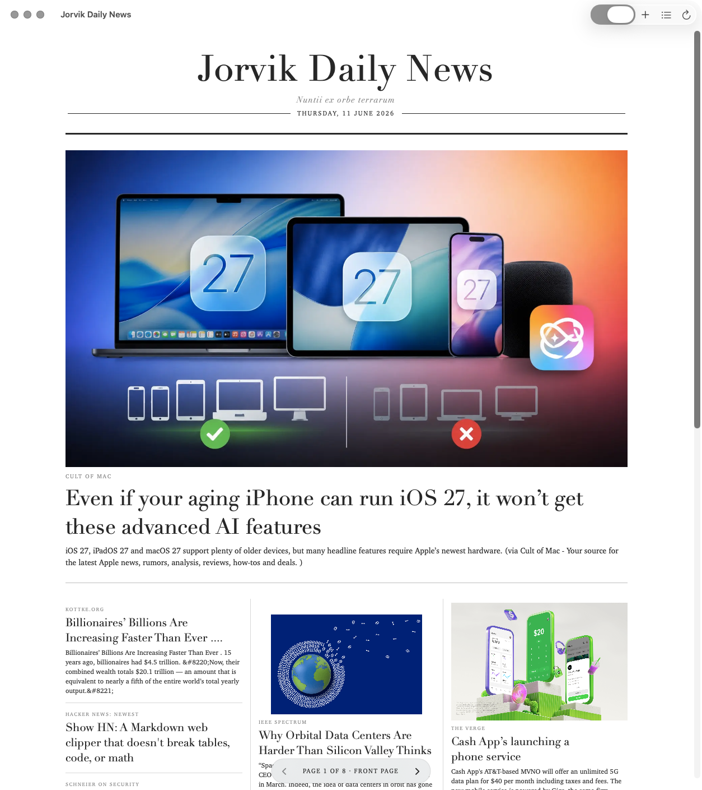
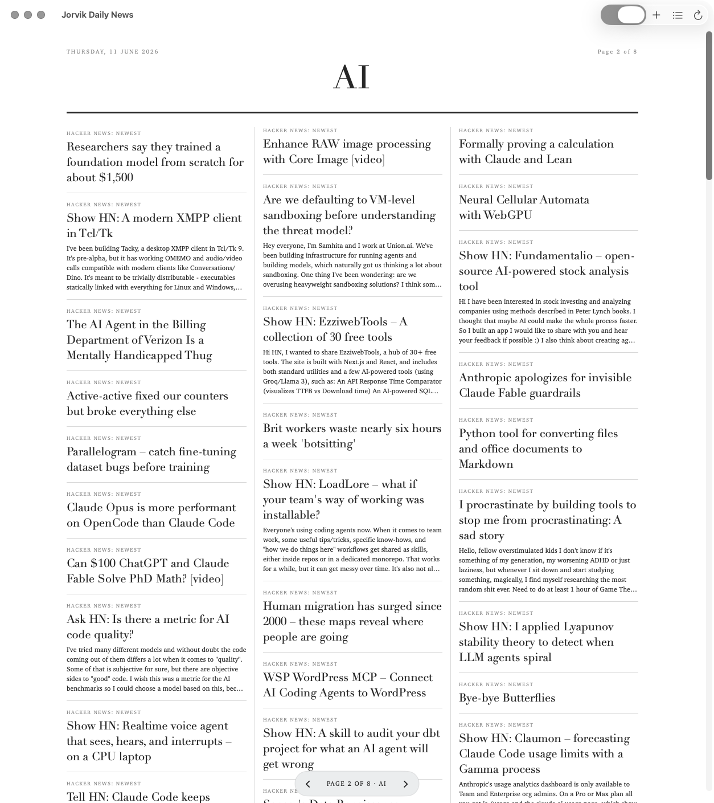

# Jorvik Daily News

**A macOS RSS reader shaped like a daily newspaper.** It publishes what your feeds put out *today* — and nothing else. No unread counts, no infinite stream, no yesterday's leftovers. You read the paper, put it down, and get on with your day.

Free, native, and open source. No account, no subscription, no telemetry, no Electron.



## Install

macOS 14 (Sonoma) or later.

```sh
brew install --cask perpetualbeta/jorvik/jorvik-daily-news
```

Or download from the [latest release](https://github.com/PerpetualBeta/JorvikDailyNews/releases/latest) — the **`.pkg`** installer is the easier first install, since it avoids quarantine and App Translocation. Both formats are signed and notarised.

## Why a newspaper

RSS readers are streams, and streams never end. You open one, scroll past the same headlines you ignored yesterday, and close it no better informed.

A newspaper is the other shape. It publishes for a day, it is finite, and you finish it.

## What makes it different

**It only shows today.** An item published yesterday never appears, however unread it is. The paper rebuilds on the hour while it is open and starts fresh after midnight.

**It reads like a paper.** A full-width lead above a three-column masonry, with sections for the topics you tag. Standfirsts are extracted from the article and fitted to the space each card actually has, rather than truncated mid-word.

**The reader has no web view in it.** An article is extracted with Mozilla's Readability and then drawn directly in SwiftUI — paragraphs, headings, nested lists, quotes, code, tables, pictures, inline SVG. No ads, no trackers, nothing in the reading path that can fail silently.

**It handles what is not an article.** Videos play in-app, PDFs render in a sandboxed helper with their size and progress shown, and a page that only builds itself in JavaScript falls back to the real page. That fallback is measured rather than assumed: if the page lays out nothing to read, you get an explanation and a button to your browser instead of a blank sheet.

**It tells you when a feed has gone quiet.** A line under the dateline when a feed has been unreachable for over a day, and a separate one, said once, when a feed answers perfectly and has published nothing for a year. Manage Feeds keeps the standing list, with a compass button that opens each site rather than its XML. Both are printer's notes, not badges: there are no unread counts in this app and nothing nags.

**It assumes your feeds are hostile.** Every byte it parses comes from somewhere it does not control, and the whole surface was reviewed on that basis across four adversarial passes. The app is sandboxed, PDFs are parsed in a helper with no network of its own, requests are restricted to the public web, and every response body has a ceiling. The one view that shows somebody else's page does not run its scripts unless you say so. [What that found →](Documentation/security.md)

**It keeps almost nothing.** Your subscriptions, what you have read, and a section classifier you train by correcting it. No database, no cloud, no cookies.

## Documentation

| Page | Description | 
| --- | --- |
| [Using it](Documentation/using-it.md) | Adding feeds, import and export, the reader pane |
| [How the paper is built](Documentation/the-paper.md) | Today-only, lead selection, standfirsts and column fitting |
| [Pictures](Documentation/pictures.md) | Enrichment, cropping, caching and the memory accounting |
| [Video, PDFs and awkward pages](Documentation/media.md) | When an item is not an article |
| [Storage](Documentation/storage.md) | What is kept, where, and what is not |
| [Handling hostile content](Documentation/security.md) | The threat model and the review's findings |
| [Architecture](Documentation/architecture.md) | The extraction ladder, the parsers, the self-test |
| [Building from source](Documentation/building.md) | `gmake build`, the test suite, updates |
| [Troubleshooting](Documentation/troubleshooting.md) | Empty paper, unopenable article, diagnostics |

## Screenshots

| Screenshot | Description | 
| :---: | --- |
|  | Section pages collect a topic's stories into their own masonry. |
|  | Add a feed by URL — or paste a site's home page and it finds the feed. |
|  | Manage Feeds: search, section, pause, or remove; a colour dot shows each feed's fetch health. |

## Licence

Public domain. Do whatever you like with it — no attribution required, no conditions.
