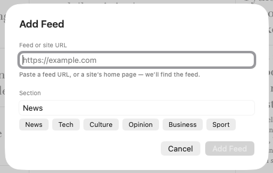
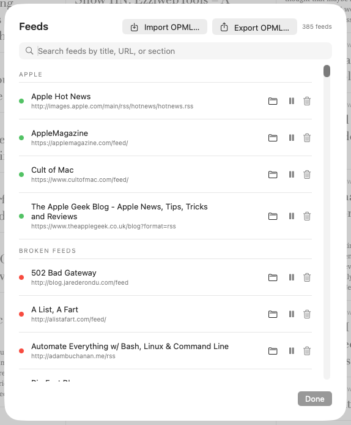

# Jorvik Daily News

A macOS RSS reader shaped like a daily newspaper. The paper only shows items whose published date falls inside today's local calendar — older items never appear, no matter how unread they are. Launch refreshes automatically and the paper re-fetches on each clock hour while it's open; `command` `R` republishes on demand. Anti-doomscroll: no unread counts, no infinite stream, finite by design.


## Requirements

- macOS 14 (Sonoma) or later
- Any RSS, Atom, or JSON feed URLs you want to read

## Installation

Two formats on every release — both signed and notarised:

- **[Installer (`.pkg`)](https://github.com/PerpetualBeta/JorvikDailyNews/releases/latest/download/JorvikDailyNews.pkg)** — recommended for first-time installs. Double-click to run; macOS Installer places the app in `/Applications` without quarantine or App Translocation.
- **[Download (`.zip`)](https://github.com/PerpetualBeta/JorvikDailyNews/releases/latest)** — unzip and drag `JorvikDailyNews.app` to your Applications folder.

Or install it with [Homebrew](https://brew.sh):

```sh
brew install --cask perpetualbeta/jorvik/jorvik-daily-news
```

## Why

RSS readers are streams. Streams never end. You open the reader, scroll past the same headlines you already ignored, and close it again no better informed.

A newspaper is the other shape. It publishes for a specific day, it's finite, you finish it. This app takes your feeds and publishes only what came out *today* — no yesterday's leftovers, no unread counts shaming you into scrolling. You read the paper, put it down, and get on with your day.

## How It Works

The paper is rebuilt from whatever your feeds have published today. While the app is open it re-fetches on each clock-hour boundary (09:00, 10:00, 11:00…) and again on wake-from-sleep, so the paper stays current without ever showing stale content. Once the clock rolls past midnight, today's paper starts fresh; the app keeps only the last few days of editions on disk and clears older ones automatically, because the whole point is today's news.

The front page is a full-width lead story above a 3-column masonry of the rest of the day's news. The lead *must* carry an image that actually loads — a text-only hero looks like a mistake at full-width span — so the builder picks the newest image-bearing story for the lead, validates and warms its image before publishing, and falls back to no lead at all (just the three columns) on a quiet day when nothing qualifies. Section pages follow if you've tagged feeds by topic (News / Tech / Culture / …). Click any headline to read the article in a clean reader pane — extracted via Mozilla's Readability, rendered in serif type, no ads, no trackers.

## Screenshots

| | |
|---|---|
|  |  |
| Section pages collect a topic's stories into their own masonry. | Add a feed by URL — or paste a site's home page and it finds the feed. |
|  | |
| Manage Feeds: search, section, pause, or remove; a colour dot shows each feed's fetch health. | |

## Using It

| Action | Shortcut |
|---|---|
| Add Feed | `command` `N` |
| Refresh | `command` `R` |
| Manage Feeds | `shift` `command` `F` |
| Import OPML | `shift` `command` `O` |
| Export OPML | `shift` `command` `E` |
| Front Page | `command` `1` |
| Previous Page | `command` `left` |
| Next Page | `command` `right` |
| Scroll to top / bottom | `Home` / `End` |
| Scroll by viewport | `PgUp` / `PgDn` |
| Back to paper (from reader) | `esc` |

### Adding feeds

`command` `N` → paste a feed URL *or a site's home page* → optionally tag with a section → Add. The app auto-discovers feeds: paste `https://arstechnica.com` and it finds the feed via `<link rel="alternate">` in the page head. If the page declares no feed, common paths (`/feed`, `/rss`, `/atom.xml`, `/feed.xml`, …) are probed as a fallback. Duplicates are rejected after resolution — you can't accidentally add the same subscription twice.

### Bulk import / export

`shift` `command` `O` imports an OPML subscription list from any reader. Nested `<outline>` categorisation becomes sections. Duplicates against your existing feeds are skipped. `shift` `command` `E` exports your feed list back out as OPML 2.0 — round-trips cleanly.

### Pausing a feed

Manage Feeds (`shift` `command` `F`) → pause icon on any row. The feed's items vanish from today's paper immediately (no network round-trip); un-pausing triggers a refresh so they come back. Useful when a feed is too noisy on a given day and you want to mute it without deleting the subscription.

### Unread only

Toggle in the toolbar. When on, read items are removed from the paper and the front page reflows — the next unread story takes the lead slot, secondaries refill, etc. When off, read items stay visible at 55% opacity as a "you've been here" affordance.

### Reader pane

Clicking a headline replaces the paper with an inline reader view (not a separate window). Mozilla Readability extracts the article's main content; a hand-tuned stylesheet renders it in Charter at 680 px column width, dark-mode aware. High-contrast colour rules override anything low-contrast the source page ships. `esc` or **Back to Paper** returns. **Open in Browser** in the header bar takes you to the original article at any time.

The reader header always shows where the material comes from: the feed's name, and beneath it the destination **host** (`economist.com`, `youtube.com`, …) in plain monospace. It's there in every reader state — article, live page, PDF, or video — so even a chrome-free embedded video tells you its source at a glance.

**Re-classify on the fly.** The header's section menu shows the article's current section ticked; pick another to move it *and* train the classifier, exactly as the right-click "Move to…" menu on the paper does — no need to leave the reader.

**Exclude a source.** The header's **Exclude Source** button drops every item pointing at the current article's host from the paper and reflows immediately. The aggregator feed that surfaced it keeps flowing — only items pointing at that host disappear. Useful for muting a domain that a dozen feeds all keep linking to.

## Smart Content Handling

### Standfirsts

A feed's body is HTML, and the only record of a paragraph break in it is a tag. Turning that HTML into plain text by replacing every tag with a space destroys the breaks, which is how a card ends up with the whole article compacted into one unreadable run. The app splits the body on its block boundaries first, so the paragraphs survive, and then takes the opening ones as a standfirst.

Which blocks count is decided structurally, not by a list of phrases to ignore. An image credit, a bare URL, an `iPad | Mac | iPhone` link row and a social strip have nothing in common textually, but all of them are far shorter than a paragraph of prose, so a minimum word count separates them without anyone having to enumerate them. Measured across 5,368 blocks from 39 subscribed feeds, real opening paragraphs run 20 words and up while that leading noise is 14 words or fewer; the threshold sits at 15, and anything from 8 to 20 gave an identical result on that sample. Code listings, scripts, stylesheets, tables and figure captions are dropped whole. Inline `<code>` is kept, because removing it puts holes in sentences.

Character references are decoded in a single left-to-right pass that never re-reads what it has written. A sequence of find-and-replace passes cannot do this: replacing `&amp;` first turns a literal `&amp;lt;` into `&lt;`, and the later pass turns that into `<`, so text the source deliberately escaped comes out as markup. Numeric references are decoded arithmetically rather than listed, which is where a fixed list failed and failed widely — across those same feeds `&#039;` appears 3,073 times, `&#8217;` 1,720, `&#39;` 1,164, `&#92;` 410 and `&#xA0;` 397, against a table holding only two of them, and a leading zero alone was enough to defeat it. Named references are a small closed set in practice (16 distinct across 39 feeds) but their tail is accented letters, so the table is generated from the HTML5 named-character-reference set rather than typed out. Nothing entity-shaped survives extraction anywhere in the sample.

Paragraphs accumulate up to a word target, and the one that crosses it is cut at a sentence rather than mid-thought. Sentence-at-a-time matters for the feeds that ship an entire article as a single `<p>` — one in that sample arrived as a 717-word paragraph — where there is no structure left to recover and only a sentence boundary can stop the wall reaching the page. That target is a storage bound rather than a layout one: it decides how much material the paper has to choose from, not how much of it appears.

### Fitting a standfirst to its space

How much appears is measured, not estimated. A standfirst is laid out with the real font at the real width before it is drawn, and cut to the last whole sentence that fits the lines available. Nothing sets a line limit, which is the point — a line limit clips the rendering and drops its ellipsis wherever the line happens to break, usually mid-word. Cutting the content instead means there is nothing left to truncate. Across the sample no column is cut mid-sentence at any of the four widths the paper can present; the only columns not ending in a full stop are ones ending at a paragraph break on a colon, or ones whose source text carries no terminal punctuation at all.

The one deliberate exception is a single sentence longer than the space it has. That is shown whole and allowed to overrun rather than replaced with nothing.

### Adaptive columns

Type is comfortable to read between roughly 45 and 75 characters a line, with about 66 as the ideal. Set across the full width of the page the lead ran to 113, half as long again as it should be, so a standfirst is set in as many columns as its width warrants: the planner rounds to the nearest whole number of ideal-width columns, an ideal column being 440pt at Charter 14, which is where the measurement puts 66 characters.

In practice that means two columns for the lead at every window size the app allows, giving a measure of 58 to 75 characters, and one column for a card. A single-column lead is only chosen below about 600pt of page width, which the 900pt window minimum puts out of reach; it would become reachable if the window were allowed narrower. Three columns arrive above about 1350pt, which the 1100pt page cap likewise puts out of reach today. Both fall out of the rule rather than being special-cased, so they follow if those limits ever move.

Columns divide at a line, not at a sentence. Where the text *ends* has to be a whole sentence, because the reader has nowhere to continue; where one column *hands over* to the next is not a truncation at all, since the sentence carries on at the top of the next column exactly as a newspaper's does. Dividing at sentences instead left a four-line column beside a seven-line one, because a paragraph too big for its share has to go over whole.

How many columns the width allows is not how many the text wants. A two-line standfirst divided in two leaves half a sentence stranded across the gutter, reading as a fault rather than a deck, so a column has to carry at least three lines to earn its place; below that the deck takes a single column and leaves the rest of the measure as white space, which is what a newspaper does with a short deck. The column keeps its planned width either way, so the line length stays comfortable. The line index only estimates this, because a column that inherits a paragraph break loses the blank line to trimming and draws shorter than its share, so the estimate is only a starting point and the drawn result decides: a column is dropped and the text re-split until every column that exists earns its place. In practice the ladder runs one column up to six lines and two from seven.

A short deck also changes the lead's shape. A full-width picture stacked over a one-line standfirst leaves the whole right-hand measure empty, so the lead is set across instead of down: picture in one column, source, headline and deck in the other. The trigger is the planner's own answer rather than another threshold — a deck short enough to want a single column is short enough to sit beside the picture. A lead with no picture stays stacked, since there is nothing to sit beside.

An even share of the line index still is not an even share of the drawn column: the blank line a paragraph break leaves behind counts as a line but is trimmed off the column that inherits it, pulling that column up to two lines short. So each boundary is nudged a line either way and the split that draws most evenly wins. Across the sample the columns now differ by at most one line, which is the floor — an odd number of lines cannot divide evenly in two. Re-planning costs a handful of layout passes, so results are cached on the text, width, font and line allowance together.

Every item is stored at the lead's length, because any item can be promoted to lead when the paper reflows and the body HTML is not kept in the edition to re-extract from. Re-extracting the real feeds at each candidate length puts the share of leads filling 14 of the deck's 16 lines at 67% for 150 words, 72% for 180 and 75% for 210, after which the feeds have no more to give; the target sits at 200, just under that plateau. Overshooting costs only disk, since the fitter cuts whatever will not fit. The knobs are `summaryMinParagraphWords`, `summaryLeadTargetWords` and `standfirstIdealColumnWidth`.

### Page metadata enrichment

When a feed ships no image **or no standfirst**, the target page's own `<head>` supplies what is missing: `og:image` / `twitter:image` / `<link rel="image_src">` for the picture, `og:description` / `twitter:description` / `<meta name="description">` for the text. One fetch answers both, so an item short of either is worth the round trip. Whatever the feed did supply is never overwritten — the page's own metadata is a fallback for what is absent, not a better source.

The description half matters most for Hacker News, whose items carry only `Article URL: / Comments URL: / Points:` boilerplate where a standfirst would go. That boilerplate is stripped, correctly, which used to leave those items with no text at all: 165 of 178 of them in one measured day, and a blank lead whenever one was promoted to it.

### Image enrichment

When a feed ships no image (HN, Daring Fireball, Michael Tsai), the newest 24 items *per section* are fetched for `<meta property="og:image">` / `twitter:image`. Per section, not per edition: the front page takes the newest items off the top, so a single edition-wide allowance was spent almost entirely on page one and the section pages got the text-only tail. Some sites publish their app icon as their social image, declaring the same file as both `og:image` and `rel="icon"` — a candidate that matches one of the page's own icon links is rejected and the next candidate tried, so a site icon never anchors a story. Where a feed *does* ship images but only tiny thumbnails (The Guardian's 140 px default), the widest declared size wins; undersized candidates fall through to the same og:image enrichment path.

### Image rendering

Pictures are never scaled above their own pixel size — a small site logo draws small, sharp and centred rather than blurred to fill the column — and are then held to a height cap. A card's is a fixed 260 points. The lead's is a share of the visible page, 46% of it, because a fixed cap turned a 2:1 photograph into a 3.1:1 letterbox at a wide window and discarded a third of its height for nothing: the cap is there to keep the headline above the fold at the smallest window, and at a large one there is no fold to protect. The share is that same constraint rewritten, derived so the 900x752 minimum still caps at 322 points exactly as the old fixed 320 did, while a page 1100 points tall shows that photograph uncropped. It stays a share rather than "whatever is left once the furniture is subtracted", because the furniture is a fixed number of points and subtracting it would let the picture take nearly the whole page at a tall window. A picture over its cap is cropped around whatever it actually shows, using Vision's attention saliency, so a phone screenshot crops to the dialogue in the middle rather than the status bar; when Vision finds nothing salient the crop stays top-aligned. Both retune on a running copy: `cardImageMaxHeight` and `leadHeroHeightFraction` for the share, with `leadHeroMaxHeight` overriding the lead's share with an absolute cap in points. A value of 0 removes a cap entirely. Sub-48-pixel images (tracking pixels, broken CDN placeholders) are rejected so they don't blot the page with empty rectangles. Images that fail to load collapse their slot — the headline rises into the vacated space.

A photograph of a person is cropped around the person. Vision's attention-based saliency answers "what is visually loudest", which on a portrait is the teeth and the collar line rather than the head, and centring on that answer cut the top of a subject's head off. Face detection runs first and attention saliency is the fallback for pictures with nobody in them; the face box is extended upward by a third of its height, because Vision bounds the face from chin to upper forehead and the crown and hair sit above that (`faceCrownAllowance`). What Vision returns is a vertical span rather than a centre point, because a centre cannot express "the subject is taller than the window you have" — and that case has a right answer: keep the top, since a cropped chin reads as a crop while a cropped crown reads as a mistake.

The lead needs both halves. A full-width slot carrying a picture and a headline but no standfirst reads as something that failed to load, the same way a text-only lead does, so an item with both is preferred. It falls back to picture-only rather than dropping the lead outright, because an incomplete lead still beats no lead.

The lead is held to a stricter standard. Its image is validated and warmed before the edition publishes, so the hero renders the instant the page appears; a slow (>12 s) or dead lead image is recorded as failed and the edition rebuilt to pick the next usable-image story instead. All image fetches are coalesced — the lead's pre-fetch and the on-screen view share a single download per URL, rather than both hitting the host at once and tripping its rate limiter.

### In-app video

Video links play *inside* the paper, chrome-free, rather than kicking you out to a browser. YouTube and Vimeo render as a borderless embedded player (loaded through a host page so the player sees a legitimate third-party origin — no "Error 152/153"); direct media files (`.mp4`, `.m4v`, `.mov`, `.webm`) play in a native `AVPlayer`.

Most video feeds label their items `[video]` already, but some submitters don't — so any headline whose link plays in-app gets a `[VIDEO]` tag appended automatically when nothing in the title or summary already signals it. You always know you're about to open a video before you click — handy when you're in an office or a library.

### PDFs

A link to a PDF — by extension, or detected by content-type when the URL doesn't end in `.pdf` — opens in a native `PDFKit` view inside the reader, scrollable and zoomable, instead of downloading or bouncing to a browser.

### Live page fallback

When Readability can't extract a clean article (paywalls, JavaScript-rendered SPAs, link-list pages), the reader doesn't dead-end you out to a browser: it renders the real page inline in a full web view. **Open in Browser** stays in the header as the escape hatch for anyone who wants it.

### Feed health

Each feed in Manage Feeds carries a colour dot: green (fetched cleanly and recently), orange (a little stale), red (repeatedly failing or long silent). Paused feeds show no dot — we deliberately stopped fetching them, so a "stale" warning would mislead.

## Storage

Everything under `~/Library/Application Support/JorvikDailyNews/`:

- `feeds.json` — feed list (URL, section, title, pause state)
- `editions/YYYY-MM-DD.json` — one file per published day; kept forever
- `read.json` — opened article IDs, persistent across sessions

No database. No telemetry. No cloud. No cookies — the reader pane uses ephemeral WebKit data stores that don't persist anything to disk or keychain.

## Updates

Updates are handled by [Sparkle](https://sparkle-project.org). The app checks for new versions automatically once a day in the background; **Jorvik Daily News → Check for Updates…** runs an on-demand check.

## Technical Details

- Pure Swift + SwiftUI. `swiftc -O` single-binary build — no Xcode project required.
- Feed parsing via Foundation's `XMLParser`. RSS 2.0 and Atom 1.0. No third-party feed library.
- Reader pane is `WKWebView` + Mozilla [Readability.js](https://github.com/mozilla/readability) (Apache-2.0, bundled as a resource). Networking goes through `URLSession` with a desktop-Safari user agent; WebKit only handles DOM + JavaScript for Readability.
- Both WebKit views use `WKWebsiteDataStore.nonPersistent()` — no cookies, no local storage, no keychain prompts.
- The Readability reader pane has content JavaScript disabled (`allowsContentJavaScript = false`); it renders static extracted HTML only. The video-embed and live-page web views run JavaScript (a player needs it), still on a non-persistent data store.
- Video plays in-app: YouTube/Vimeo via a chrome-free `<iframe>` host page in `WKWebView`; direct media via `AVKit`'s `AVPlayer`. PDFs render in `PDFKit`. No video or PDF ever bounces you out to a browser.
- Hero images load through a process-wide `ImageCache` that decodes into an `NSCache` and coalesces concurrent requests for a URL onto one in-flight task — so a page turn doesn't re-download, and the lead's prefetch and on-screen view never double-fetch.
- Edition composition: dedupe by canonical link, then round-robin across feeds so no source dominates, then image-*requiring* lead selection (validated before publish, lead dropped if none qualifies), then 3-column masonry for everything else.

## Building from Source

The build is driven by the shared [`release.mk`](https://github.com/PerpetualBeta/jorvik-release) Make include, so `jorvik-release` has to be checked out **beside this repo** — the Makefile looks for it at `../jorvik-release/`. macOS ships GNU Make 3.81 as `make`, which is too old, so `gmake` comes from [Homebrew](https://brew.sh).

```bash
brew install make   # GNU Make 4+, if you do not already have gmake
git clone https://github.com/PerpetualBeta/jorvik-release.git
git clone https://github.com/PerpetualBeta/JorvikDailyNews.git
cd JorvikDailyNews
gmake build
open.build/JorvikDailyNews.app
```

`gmake build` compiles with `swiftc -O` and ad-hoc-signs for local use. JorvikKit files are compiled in from `JorvikKit/`. Release builds are Developer ID signed and notarized.

To regenerate the app icon (Didot "N" over a dark ink gradient with newspaper masthead rules):

```bash
swift generate_icon.swift
```

## Troubleshooting

### The paper is empty today

Either no feeds have published today yet, or every feed fetch failed (check your internet connection and hit `command` `R`). The today-only filter is strict — items dated before midnight local time don't appear. If you've just added feeds and they don't seem to have today's items, some feeds only publish weekly or less frequently.

### Readability fails on a site

Paywalled sites, JavaScript-rendered SPAs, and some custom CMSes resist extraction. The reader pane falls back to the feed's own summary plus an **Open in Browser** button — click that to read on the original site.

### Images missing from some items

Not every feed ships images, and not every article has an `og:image`. Hacker News items and some text-only blogs won't have thumbnails — the card just shows the headline, which is often fine.

---

Jorvik Daily News is provided by [Jorvik Software](https://jorviksoftware.cc/). If you find it useful, consider [buying me a coffee](https://jorviksoftware.cc/donate).
